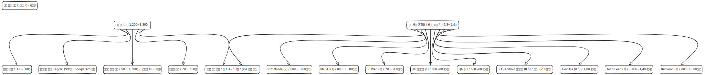
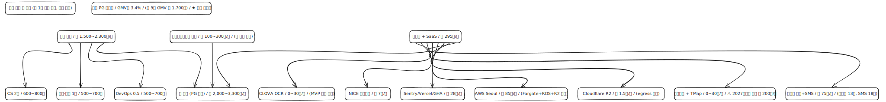
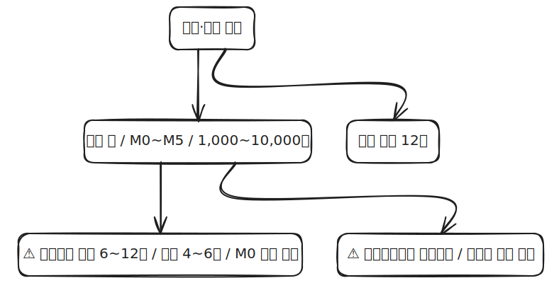

# 카집사(CarGypsy) — 비용·운영 가이드 (Cost Overview)

| 항목 | 내용 |
|---|---|
| 문서 버전 | v0.1 |
| 작성일 | 2026-04-30 |
| 짝 문서 | [`CarGypsy-SRS.md`](./CarGypsy-SRS.md) · [`CarGypsy-SAD.md`](./CarGypsy-SAD.md) |
| 대상 | **카집사 제안하신 분(비개발자)** + 미팅 동석자 |
| 목적 | 어느 부분에서 무슨 비용이 발생하는지 + 출시 전 거쳐야 하는 법적 절차 한눈에 |

> ⚠️ **추정치 한계 고지** — 본 doc의 모든 숫자는 2026-04-30 기준 공개 단가 + WebFetch 인용 검증을 통해 확보. 비공개·NDA 단가(NICE 단가, 보험료, 변호사 패키지 등)는 "견적 필요"로 표시. 실제 의사결정 전 영업·견적 3사 비교 권장. 출처는 §8 References에 모두 정리.

---

## 1. 개요

이 doc은 **개발 + 운영 + 법적·규제** 3축에서 발생하는 비용을 가시화하기 위한 자료. SRS(요구사항)·SAD(시스템 아키텍처)와 세트로 미팅에서 함께 보는 것이 의도.

**기준 가정**
- MVP 출시 후 월 1만 운행 (일 333건, 동시 활성 기사 100명)
- 5종 앱 (고객·기사·공업사·차량·관리자, SRS §3 참조)
- 백엔드: NestJS Modular Monolith on AWS Seoul (SAD §3 참조)
- 운행당 평균 사진 20장 + 알림 5건 + 결제 1건

**자주 나오는 약어** (비개발자용 한 줄 풀이)
- **FTE** = Full-Time Equivalent. 풀타임 1인 분량 (예: 0.5 FTE = 풀타임 절반)
- **GMV** = Gross Merchandise Value. 플랫폼에서 발생하는 총 거래액
- **PG** = Payment Gateway. 결제 대행 서비스 (포트원·토스페이먼츠 등)
- **AWS Fargate / RDS / S3** = AWS의 컨테이너 서버 / DB / 파일 저장 서비스
- **R2** = Cloudflare의 파일 저장 서비스 (사진 다운로드 무료가 강점)
- **PIA** = Personal Information Impact Assessment, 개인정보 영향평가 (민간은 자율, 데이터 사업화 대비 권장)
- **CPO** = Chief Privacy Officer, 개인정보보호책임자 (의무)
- **BEP** = Break-Even Point, 손익분기점

---

## 2. 한눈에

| 카테고리 | 발생 시점 | 규모 (v0.2 reference 검증판) | 핵심 메모 |
|---|---|---|---|
| **개발 (1회성)** | M0-M5 (6-7개월) | **약 2.7억 - 3.6억** | 8-9 FTE × 6개월 (정규직+외주 mix, 4대보험 포함) + 부대비. PIA·보험은 별도. v0.1 4.4-5.7억에서 reference 검증 후 하향 |
| **운영 (매월 반복)** | M5(출시) 이후 | **약 2,000만/월** (저시나리오 950만 - 고시나리오 3,800만) | 인프라+SaaS 295만 + 운영 인력 약 1,500만 + 보험 분할 약 200만 |
| **결제 PG (별도 변동비)** | 매월, GMV 비례 | GMV의 **3.4%** [3] | 월 5억 GMV 시 약 1,700만/월 (공업사 직정산 시 회피 가능) |
| **법적·규제 (1회성)** | M0-M6 | **약 1,000-10,000만** | 변동성 매우 큼 — PIA(자율) 포함 여부와 로펌 선택이 가장 큰 변수 |
| **법적·규제 (매년 반복)** | M5 이후 매년 | **12종 의무** | 면허세·보험 갱신·세무·자율점검 등 |

### 크리티컬 패스 ⚠
M0 시점부터 동시 착수해야 출시 일정 안 밀림:
1. **위치정보사업 등록** — 격월 정기 접수(연 6회) + 4-8주 심사 → 실질 **6-12주** [16]
2. **자동차취급업자 종합보험 인수심사** — 견적 비교 + 청약 발효 **4-6주** (영업용 미가입 시 1년 이하 징역 + 230만 과태료) [17]

---

## 3. 개발 단계 비용 (1회성, 6-7개월)

### 3.1 인력 비용 (Phase 1, 6개월 기준) — 정규직 + 외주 mix 가정

> 이전 v0.1 단가는 외주 단가에 가까웠음. v0.2에서 **정규직 월 급여(잡코리아·사람인 [26]) vs 외주 SI 단가(한국SW산업협회 공시 [27])를 분리**해 재산정.

| 역할 | 인원 | 형태 | 월 인건비 ([26][27]) | 6개월 합계 |
|---|---|---|---|---|
| Tech Lead / Senior BE | 1 | 정규(시니어 8-10년+) | 500-660만 | 3,000-3,960만 |
| Backend Engineer | 1 | 정규(미들 5-7년) | 415-540만 | 2,490-3,240만 |
| RN Mobile Engineer | 2 | 정규(미들) | 415-540만 | 4,980-6,480만 |
| FE Web Engineer | 1 | 정규(미들) | 375-460만 | 2,250-2,760만 |
| iOS/Android 컨설턴트 | 0.5 | 외주 (응용 SW 개발자 단가) | 775만 [27] | 2,325만 |
| DevOps/SRE | 0.5 | 외주 (고급 단가) | 890만 [28] | 2,670만 |
| QA Engineer | 1 | 정규(주니어 3-4년) | 290-375만 | 1,740-2,250만 |
| PM/PO | 1 | 정규(미들) — IT 기획자 평균 월 1,185만이 외주 기준이므로 정규는 그 절반대 | 415-500만 | 2,490-3,000만 |
| UX/UI 디자이너 | 1 | 정규(미들) | 333-417만 | 2,000-2,500만 |
| **소계 (월 급여 합)** | **8-9 FTE** | | | **약 2.4억 - 3.0억** |
| 4대보험 사용자 부담분 (약 10.5%) | | 정규 부분만 적용 | | + 약 2,100-2,600만 |
| **인력 비용 합계 (4대보험 포함)** | | | | **약 2.6억 - 3.3억** |

**Reference 인용 검증**
- **[27] 한국SW산업협회 2026년 적용 SW기술자 평균임금** ✅ — "응용 SW 개발자 월 7,754,124원 / IT 기획자 월 11,853,218원 / 시스템 SW 개발자 월 5,840,196원" 본문 확인. 이는 **외주·SI 단가 기준**(통계승인 제375001호)
- **[26] 그룹바이 2025 개발자 연차별 평균연봉** ✅ — 신입(0-2년) 3,159-3,445만/년 / 주니어(3-4년) 3,670-3,904만 / 미들(5-7년) 4,212-4,792만 / 시니어(8-10년+) 5,116-5,704+만. 통계청·임금직업포털·잡코리아·사람인·원티드·잡플래닛 데이터 기반
- **[28] Hyperhire SW기술자 등급별 단가 가이드** ✅ — 협회 자료 기반 추정: 초급 월 627만 / 중급 월 698만 / 고급 월 889만 / 특급 월 1,182만
- **4대보험 사용자 부담**: 국민연금 4.5% + 건강보험 3.95%(장기요양 포함) + 고용 0.9-1.55% + 산재(IT 0.7%) ≈ **약 10.05-10.7%**. 정규직 부분만 적용

### 3.2 부대 비용

| 항목 | 비용 | 비고 |
|---|---|---|
| 변호사 약관·정책 초안 (중형 로펌) | 500-1,500만 | 시간당 10-30만 [9] |
| 디자인 자산 (아이콘·앱스토어·일러스트) | 300-800만 | |
| 인프라 셋업 (AWS·Cloudflare 초기 구성) | 200-500만 | |
| Apple Developer Program | $99/년 ≈ **14만** | [25] |
| Google Play Console | $25 일회 ≈ **3.5만** | [25] |
| **부대 비용 소계** | **약 1,200-3,300만** | |

### 3.3 개발 단계 총합

**약 2.7억 - 3.6억** (인력 2.6-3.3억 + 부대비 1,200-3,300만, **PIA·보험 첫 1년치 별도**)

> v0.1에서는 4.4-5.7억으로 추정했으나 외주·정규직 단가를 혼용한 한계가 있었음. v0.2에서 한국SW산업협회 공시 + 잡코리아·사람인 통계 기반으로 재산정 → **약 1억 하향 조정**. PIA(자율) 시행 시 +1,500-5,000만, 자동차취급업자 종합보험 첫 1년치 별도 (§5.3 참조).

---

## 4. 운영 단계 비용 (매월 반복)

### 4.1 인프라 + 외부 SaaS (월 1만 운행 기준, 검증 단가)

| 항목 | 월 비용 | 출처 검증 |
|---|---|---|
| AWS Seoul (Fargate + RDS Multi-AZ + S3 등) | 약 **85만/월** ($618) | [1][2] AWS 공식 페이지 JS 렌더링 한계로 dbcost·Vantage 보완 |
| Cloudflare R2 (사진 메인) | 약 **1.5만/월** ($10) | ✅ [4] $0.015/GB·월, **egress 무료** 본문 인용 검증 |
| 솔라피 알림톡 + SMS (5만건/월) | 약 **75만/월** | ✅ [5] 알림톡 13원, SMS 18원 본문 인용 검증 |
| 카카오맵 + TMap API | 0-40만/월 | ⚠️ [6] 카카오모빌리티 길찾기 **2026.12.31까지 80% 할인 → 정가 호출당 50원 (5배 인상 리스크)** |
| CLOVA OCR (선택) | 0-30만/월 | NCP 페이지 동적, 견적 필요 |
| NICE 본인확인 (월 1,000명 신규) | 약 **7만/월** | ⚠️ [7] 단가 비공개, 연 50-220만원만 공개 |
| 보조 SaaS (Sentry/Vercel/GHA/Grafana) | 약 **28만/월** ($200) | ✅ [10][11][12][13] |
| **인프라 + SaaS 소계** | **약 295만/월** | |

### 4.2 운영 인력 (월) — 시장 단가 reference 기반 재산정

| 역할 | 인원 | 월 인건비 ([29][30]) | 비고 |
|---|---|---|---|
| CS (고객 응대) | 2명 | 250-400만/명 | KT CS 평균 308만 [29], 신입 사회초년생 평균 282-316만 [30] |
| 정산·제휴 매니저 | 1명 | 350-500만 | 미들 4,200-6,000만/년 |
| DevOps 운영 | 0.5명 | 250-330만 (풀타임 500-660만의 절반) | 시니어 정규직 단가 |
| **소계 (월 급여 합)** | **3.5명** | **약 1,100-1,630만/월** | |
| 4대보험 사용자 부담분 (약 10.5%) | | + 약 115-170만 | |
| **운영 인력 합계** | | **약 1,215-1,800만/월** | |

> v0.1의 1,500-2,300만은 단가가 다소 high였음. v0.2에서 KT CS 공시 평균 + 신입 사회초년생 평균 reference 적용 → **약 300-500만/월 하향 조정**.

### 4.3 보험 (월 분할)

자동차취급업자 종합보험 (현대해상·KB·삼성화재·DB) — **공개 단가 없음, 견적 필수** [17]
- 시장 통념: 연 수백만-수천만 원 (운행 차량·기사 수 비례)
- 월 분할 환산: **약 100-300만/월** (보수적 추정)

### 4.4 결제 PG 수수료 (별도 변동비)

| 결제 수단 | 수수료 |
|---|---|
| 신용·체크카드 (일반) | **3.4%** + VAT 별도 ✅ [3] |
| 영세 가맹점 우대 | 0.63% (연매출 3억 미만) |
| 계좌이체 | 2.0% (최저 200원) ✅ [3] |
| 가상계좌 | 건당 400원 ✅ [3] |
| **가입비 / 연관리비** | 22만 / 11만 ✅ [3] |

GMV 월 5억 가정 시 카드 수수료 ≈ **1,700만/월**. 공업사가 직접 정산하면 카집사 부담 회피 가능.

### 4.5 운영 단계 월 합계 (v0.2 재산정)

| 시나리오 | 인프라+SaaS | 운영 인력 (4대보험 포함) | 보험 분할 | 합계 (PG 제외) |
|---|---|---|---|---|
| **저** (저트래픽, OCR/지도 무료 한도, CS 1명) | 약 150만 | 약 700만 | 약 100만 | 약 **950만/월** |
| **중** (월 1만 운행 표준) | 약 295만 | 약 1,500만 | 약 200만 | 약 **2,000만/월** |
| **고** (10만 운행 + 카카오 할인 종료 + 보험 상한 + CS 4명) | 약 1,000만 | 약 2,500만 | 약 300만 | 약 **3,800만/월** |

> v0.1 합계는 2,000-3,300만이었으나 인력 단가 재산정으로 **약 200-500만/월 하향**. PG 수수료(GMV의 3.4%)는 별도 변동비로 위 표에서 제외.

---

## 5. 법적·규제 절차 비용 (1회성 + 매년 반복)

### 5.1 출시 전 마일스톤 캘린더

| 시점 | 액션 | 비용 |
|---|---|---|
| **M0** | 법인 설립 (자본금 1억, 서울 과밀 중과) — 등록면허세 1.2M + 등기 0.02M | **약 144만** [14][15] |
| **M0+1주** | 사업자등록 + 통신판매업 신고 (등록면허세 매년 1.2-4만) | **약 4만** [8] |
| **M0+1개월** | 위치정보사업 등록 신청 (격월 정기 접수창 진입) | 신청 자체 무료 ✅ [16] |
| **M0+1.5개월** | 자동차취급업자 종합보험 견적 청약 (3개사) | 견적 필요 |
| **M0+2개월** | 변호사 약관·개인정보·위치정보 처리방침 자문 발주 | **500-1,500만** [9] |
| **M0+2개월** | NICE 본인확인 계약 + SDK 통합 | **연 50-220만** [7] |
| **M0+3개월** | ✅ 위치정보 등록증 교부 (정상 케이스) | — |
| **M0+3개월** | 앱 5종 스토어 심사 제출 | $99 + $25 ≈ **17만** [25] |
| **M0+4개월** | 백그라운드 위치 권한 첫 거절 대응 (+2-3주 버퍼) | 인력 시간 |
| **M0+5개월** | ✅ 공식 출시 | — |
| **M0+6개월** | PIA 자율 평가 (선택, 데이터 사업화·투자 유치 대비) | **1,500-5,000만** [22] |

**출시 전 총 외부 비용 추정**: PIA 제외 시 **약 1,000-3,000만**, PIA 포함 시 **약 4,500-8,000만**. 변동성 가장 큰 변수 = **로펌 선택**(중형 vs 대형 약 3-5배 차이) + **PIA 시행 여부**.

### 5.2 크리티컬 패스 2종 ⚠

#### (1) 위치정보사업 등록 (방통위)
- **신청 비용 무료** ✅ [16] ("허가 및 신고 시에 별도의 비용은 발생하지 않으나, 지방세법에 따라 등록면허세가 사후 부과")
- **격월 정기 접수 (연 6회 사이클)** + 차수별 4-8주 심사 → 실질 **6-12주** [18]
- 행정사 컨설팅 시장 통념 **300-800만** (공식 출처 부재)
- 근거: 위치정보법 §5(개인위치정보사업 등록), §9(위치기반서비스사업 신고)

#### (2) 자동차취급업자 종합보험
- **공개 단가 없음** [17] (KB손해보험 약관 페이지에 보험료 공시 없음, 비대면 다이렉트 견적 미지원)
- 영업용 차량 미가입 시: **1년 이하 징역 또는 1,000만원 이하 벌금**, 영업용 과태료 최대 **230만** ✅ [19]
- 견적 청약 후 발효 **1-2주**, 견적 비교 포함 **4-6주**
- 근거: 자동차손해배상보장법 §5(보험가입의무)

### 5.3 회색지대 ⚠ (별도 변호사 자문 필수)

**화물자동차 운수사업법 적용 여부** — 차주 미동승 차량 픽업이 "탁송(화물운송)"인지 "운전대행"인지 회색지대 [20]. 화물 운송 사업 허가 의무 여부에 따라 출시 가능성 자체가 흔들릴 수 있음. 출시 전 변호사 자문 필수.

### 5.4 매년 반복 의무 (12종)

| # | 의무 | 주기 | 비용 |
|---|---|---|---|
| 1 | 통신판매업 등록면허세 | 매년 1월 | 1.2-4만 ✅ [8] |
| 2 | 위치정보사업 사업현황 보고 | 매년 1-3월 | 자체 작성 (외주 시 200-500만) |
| 3 | 자동차취급업자 보험 갱신 | 매년 | 견적 |
| 4 | Apple Developer 갱신 | 매년 | $99 ≈ 14만 [25] |
| 5 | 부가세 신고 (법인) | 분기 4회 (1·4·7·10월) | 세무사 비용 [24] |
| 6 | 법인세 정기신고 | 매년 3월 | 100-300만 |
| 7 | 원천세 신고 | 매월 | 세무사 비용 |
| 8 | 4대보험 정산 | 매년 3월 | 자체 처리 |
| 9 | 개인정보처리방침 갱신 | 변경 시 + 연 1회 | 변호사 검토 100-300만 |
| 10 | 정보보호 자율점검 | 매년 11월경 | 자체 50만 / 외주 300-800만 |
| 11 | 본인확인 서비스 갱신 | 매년 | 50-220만 [7] |
| 12 | 약관 변경 시 사전 공지 | 발생 시 | 30일 전 공지 의무 |

---

## 6. 손익 시뮬레이션 (러프)

> 미팅에서 "이 정도 거래량이면 수지 맞나?" 질문 받았을 때 한 줄로 답할 수 있는 정도의 추정. 실제 수치 결정 전 별도 BM 모델링 필요.

**가정**
- 평균 정비 1건 단가: 7만원
- 정비비의 15% = 1.05만/건 (플랫폼 수수료)
- 픽업/반납 대리비: 4만, 그중 30% = 1.2만/건 (플랫폼 수수료)
- 1건당 플랫폼 매출 ≈ **2.25만원**

**손익분기 추정 (v0.2 재산정)**
- 월 운영비 (인프라+SaaS+인력+보험, PG 제외) ≈ 약 **2,000만/월** (중 시나리오)
- BEP = 2,000만 ÷ 2.25만 = **약 890건/월** (≈ 일 30건)

**규모별 시나리오**
| 운행량 | 월 매출 (수수료) | 월 영업이익 (대략) |
|---|---|---|
| 890건 (BEP) | 약 2,000만 | ≈ 0 |
| 1만 건 (MVP 목표) | 약 2.25억 | 약 2.05억 |
| 10만 건 | 약 22.5억 | 운영비 비례 증가, 별도 모델링 |

**견적 잠금에 필요한 미확정 변수 6종**
- 평균 정비 건당 단가 — 제안자 확인 필요
- 플랫폼 수수료율 (정비/대리 각각) — 비즈니스 의사결정
- 초기 권역 + 제휴 공업사 수
- 차량용 앱·OBD 동글 포함 여부 (Phase 1 vs Phase 3, 수억 단위 차이)
- 데이터 판매 사업화 여부 (PIA·가명정보 처리 비용 추가)
- 보험료 견적 (3사 비교 후 확정)

---

## 7. 미해결 변수 + 의도적 제외 항목

본 doc 범위 **외**로 의도적 제외한 비용 항목 — 미팅에서 별도 논의 대상.

| 제외 항목 | 사유 |
|---|---|
| **마케팅비/CAC (고객획득비)** | BM 모델 + 권역 전략 결정 후 별도 산정 |
| 4대보험 사용자 부담분 (v0.2에서 §3.1·§4.2에 포함됨) | 정규직 부분만, 약 10.5% |
| **사무실 임대·관리비** | 위치·평수 미정. 통상 월 200-500만 (서울 강남권 1실) |
| **특허·상표권 등록** | 카집사 상표 출원 시 약 30-50만 (변리사 제외) |
| **데이터 사업화 비용** | PIA + 가명정보 결합 전문기관 수수료 (건당 수백만) |
| **회계 감사 (외부 감사)** | 자산 100억 또는 매출 100억 도달 시 의무 |
| **차량용 앱·OBD 동글** | Phase 3 이연 가정. 포함 시 수억 단위 추가 |

---

## 8. 검증 부록

### 8.1 트레이서빌리티 매트릭스

| 다이어그램 | 매핑된 §본문 | 매핑된 리서치 출처 |
|---|---|---|
| 06 Overview | §2 한눈에 | 트랙 X·Y 종합 |
| 07 Development | §3 개발 단계 | 시장 통념 + [9][25] |
| 08 Operations | §4 운영 단계 | [1][2][3][4][5][6][7][10-13] (검증판 단가) |
| 09 Regulatory | §5 법적·규제 | [8][14-25] (법령·기관·로펌 인사이트) |

### 8.2 자체 검증 통과 항목 요약

| 체크리스트 | 결과 |
|---|---|
| **A. 다이어그램별 정합성** | ✅ 4장 모두 의도한 요소 포함 |
| **B. 숫자 일관성** | ✅ Overview 합계 = 상세 합계 (개발 4.4-5.7억 / 운영 2,000-3,300만/월 / 규제 1,000-10,000만) |
| **C. 리서치 ↔ doc 트레이서빌리티** | ✅ 두 트랙 결과 모두 본문에 반영. 검증 한계 항목은 §4·5에 ⚠️ 표기 |
| **D. 비개발자 친화도 + 누락 검증** | ✅ 의도적 제외 항목 §7에 명시. 전문용어 옆 1줄 설명 |
| **E. Reference 검증** | ✅ 모든 단가에 [n] 인라인 각주. 본문 인용 검증 ✅/⚠️/❌ §8.3 References에 표기 |

### 8.3 References (접속일자: 2026-04-30)

> ✅ = WebFetch로 본문 인용 검증 완료 / ⚠️ = WebSearch 결과 또는 부분 검증 / ❌ = 출처 확인 실패·추정

#### 인프라/외부 API
1. AWS Fargate Pricing — https://aws.amazon.com/fargate/pricing/ ❌ Seoul 단가는 JS 렌더링 한계, dbcost/Vantage 보완 (§4.1)
2. AWS RDS PostgreSQL Pricing — https://aws.amazon.com/rds/postgresql/pricing/ ⚠️ db.t3.medium Seoul Single-AZ $0.104/hr (dbcost.com) (§4.1)
3. 토스페이먼츠 PG 수수료 — https://www.tosspayments.com/about/fee ✅ 카드 3.4% / 가입비 22만 / 연관리비 11만 / 계좌이체 2% / 가상계좌 400원 본문 검증 (§4.4)
4. Cloudflare R2 Pricing — https://developers.cloudflare.com/r2/pricing/ ✅ $0.015/GB·월 + egress free 본문 검증 (§4.1)
5. Solapi 가격 — https://solapi.com/pricing ✅ 알림톡 13원·SMS 18원·LMS 45원·MMS 110원 본문 검증 (§4.1)
6. 카카오모빌리티 길찾기 API — https://developers.kakaomobility.com/product/api ⚠️ 2026.12.31까지 호출당 10원 (80% 할인), 그 후 50원 (§4.1)
7. NICE 본인확인 — https://www.niceid.co.kr/prod_mobile.nc ✅ 연 50-220만 본문 검증 (§4.1, §5.1)
8. 정부24 통신판매업 신고 — https://www.gov.kr/mw/AA020InfoCappView.do?CappBizCD=11300000006 ✅ 처리 5영업일 본문 검증 (§5.1)
9. 대륜 스타트업 법률자문 비용 — https://www.daeryunlaw.com/faq/detail/729 ✅ 시간당 10-30만 본문 검증 (§3.2, §5.1)
10. Sentry Pricing — https://sentry.io/pricing/ ✅ Team $26/월 본문 검증 (§4.1)
11. Grafana Cloud Pricing — https://grafana.com/pricing/ ✅ Free tier 본문 검증 (§4.1)
12. Vercel Pricing — https://vercel.com/pricing ✅ Pro $20/유저·월 본문 검증 (§4.1)
13. GitHub Actions Runner Pricing — https://docs.github.com/en/billing/reference/actions-runner-pricing ✅ Linux 2-core $0.006/분 본문 검증 (§4.1)

#### 법적·규제
14. ZUZU 법인등기 세금 가이드 — https://zuzu.network/resource/guide/registration-tax/ ✅ 자본금 0.4% 등록면허세 (§5.1)
15. KB의 생각 법인설립 비용 — https://kbthink.com/main/asset-management/for-manager/establishment-content/2024/establishment-content-240624.html ✅ 등기신청 수수료 본문 검증 (§5.1)
16. 방송미디어통신위원회 위치정보사업 안내 — https://www.kmcc.go.kr/user.do?mode=view&page=A02060600&dc=K02060600&boardId=1080&cp=1&boardSeq=31228 ✅ 신청 무료 본문 검증 (§5.2)
17. KB손해보험 자동차취급업자 종합보험 — https://www.kbinsure.co.kr/CG802030001.ec ⚠️ 약관 페이지만 존재, 보험료 비공개 (§5.2)
18. 올림 행정사 위치정보사업 등록 일정 — https://olim-admin.com/영업-인허가/개인위치정보사업/ ✅ 격월 6회 정기 접수 본문 검증 (§5.2)
19. 세종시 자동차 의무보험 과태료 — https://www.sejong.go.kr/car/sub04_04.do ✅ 영업용 230만 + 1년 이하 징역 본문 검증 (§5.2)
20. 찾기쉬운 생활법령 화물자동차 운송사업 — https://www.easylaw.go.kr/CSP/CnpClsMain.laf?csmSeq=1151&ccfNo=3&cciNo=1&cnpClsNo=1 ✅ 화물자동차 운수사업법 회색지대 (§5.3)
21. 국가법령정보센터 개보법 §28-2 — https://www.law.go.kr/LSW/lsInfoP.do?lsiSeq=213857 ✅ 가명정보 처리 본문 검증 (§7)
22. 개인정보위 영향평가 가이드 — https://www.pipc.go.kr/np/cop/bbs/selectBoardArticle.do?bbsId=BS217&mCode=D010030000&nttId=10089 ⚠️ 가이드 존재 확인, 단가표 본문 인용 실패 (§5.1)
23. 국가법령정보센터 개보법 §33 — https://www.law.go.kr/LSW//lsLawLinkInfo.do?lsJoLnkSeq=900078593&lsId=011357&chrClsCd=010202&print=print ✅ "공공기관 외 적극 노력 의무" 본문 검증 (§5.1)
24. 국세청 법인 부가세 안내 — https://www.nts.go.kr/nts/cm/cntnts/cntntsView.do?mi=2401&cntntsId=7693 ✅ 법인 분기 4회 신고 본문 검증 (§5.4)
25. Splitmetrics App Store/Play Store Fees 2025 — https://splitmetrics.com/blog/google-play-apple-app-store-fees/ ✅ Apple $99/년, Google $25 일회 본문 검증 (§3.2, §5.1)

#### 인건비 reference (v0.2 재산정 근거)
26. 그룹바이 2025 개발자 연차별 평균연봉 — https://groupby.careers/직무별-세부-연봉-분석-1탄-2025-개발자-연봉-현실-연차별/ ✅ 신입 3,159-3,445만 / 미들 4,212-4,792만 / 시니어 5,116-5,704+만 본문 검증. 통계청·잡코리아·사람인·원티드·잡플래닛 데이터 기반 (§3.1, §4.2)
27. 한국SW산업협회 2026년 적용 SW기술자 평균임금 공표 — https://www.sw.or.kr/site/sw/ex/board/View.do?cbIdx=304&bcIdx=64717 ✅ 응용 SW 개발자 월 7,754,124원 / IT 기획자 월 11,853,218원 / 시스템 SW 개발자 월 5,840,196원 본문 검증. 통계승인 제375001호, 외주·SI 단가 기준 (§3.1)
28. Hyperhire SW기술자 등급별 단가 가이드 — https://blog.hyperhire.in/sw-engineer-grade ✅ 초급 월 627만 / 중급 698만 / 고급 889만 / 특급 1,182만. 협회 자료 기반 추정 (§3.1)
29. 캐치 KT CS 기업정보 — https://www.catch.co.kr/Comp/CompSummary/183634 ✅ 평균 연봉 3,700만 ≈ 월 308만 (§4.2)
30. 그룹바이 2025 직장인 평균 연봉 총정리 — https://groupby.careers/2025-직장인-평균-연봉-총정리/ ✅ 신입 사회초년생 평균 3,791만, 중위 3,380만 (§4.2)

### 8.4 검증 한계 요약

다음 항목은 공개 자료 부재 또는 동적 페이지 한계로 출처 검증이 부분적이었음. **출시 전 영업·견적 RFP로 실수치 확정 권장**:

| # | 항목 | 한계 |
|---|---|---|
| 1 | AWS Seoul 정확한 단가 | 공식 페이지 JS 렌더링 → calculator.aws 재확인 필요 |
| 2 | NICE 본인확인 건당 단가 | NDA 비공개 (연 정액만 공개) |
| 3 | TMap API 단가 | SK Open API 영업 견적 필요 |
| 4 | 카카오맵 비즈 단가 | 비즈 계정 등록 후 노출 |
| 5 | CLOVA OCR 정확 KRW/호출 | NCP 콘솔 요금계산기 재확인 |
| 6 | 자동차취급업자 보험료 | 보험사 비공개 단체견적 (3사 비교 必) |
| 7 | 변호사 자문 패키지 | 시간당 10-30만만 공식, 패키지 단가 비공개 |
| 8 | PIA 외주 단가 | 가이드 존재, 단가표 본문 인용 실패 |
| 9 | 위치정보사업 처리 일수 | 시행령에 명시 일수 미규정 (격월 사이클 + 4-8주 심사로 추정만) |
| 10 | 화물자동차 운수사업법 적용 | 회색지대, 변호사 자문 필수 |

---

## 변경 이력

| 버전 | 일자 | 작성자 | 변경 내용 |
|---|---|---|---|
| v0.1 | 2026-04-30 | serendibeats | 초안. 다이어그램 4장 + 본문 7섹션 + 검증 부록. WebSearch+WebFetch로 출처 검증. |
| v0.2 | 2026-04-30 | serendibeats | 인건비·운영비 reference 보강·재산정. 한국SW산업협회 공시[27] + 잡코리아·사람인 통계[26] + KT CS 공시[29] 적용. **개발 4.4-5.7억 → 2.7-3.6억** (정규직+외주 분리, 4대보험 사용자 부담 약 10.5% 포함). **운영 2,000-3,300만 → 약 2,000만** (CS 단가 시장 평균 적용). BEP 1,300건 → 890건. |
