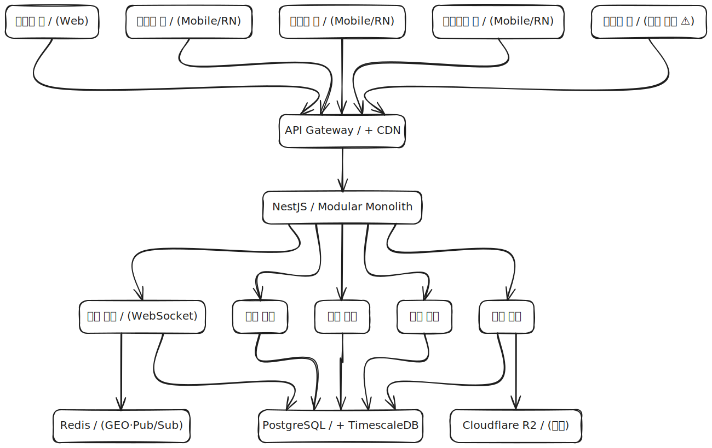
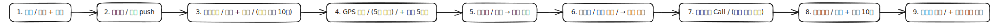
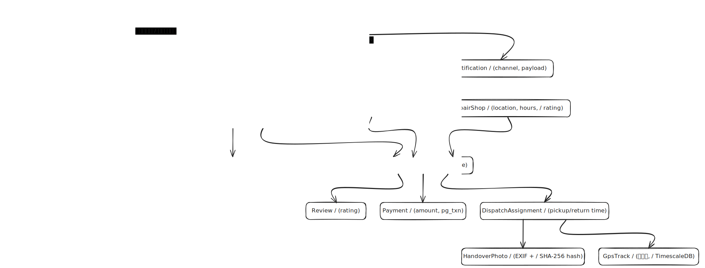
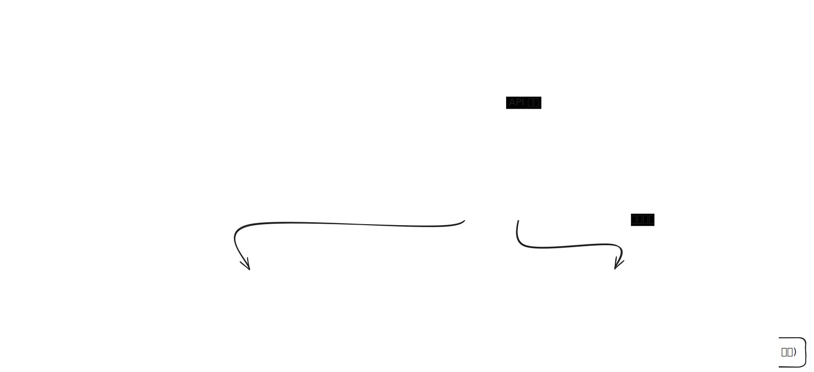

# 카집사(CarGypsy) — 소프트웨어 아키텍처 문서 (SAD)

| 항목 | 내용 |
|---|---|
| 문서 버전 | v0.1 |
| 작성일 | 2026-04-30 |
| 짝 문서 | [`CarGypsy-SRS.md`](./CarGypsy-SRS.md) |
| 작성자 | serendibeats |
| 대상 | 미팅 자료(SRS와 세트). 비개발자도 같이 보면서 "이렇게 큰 시스템이 필요하구나"를 한눈에 체감 |

---

## 1. 개요

카집사는 차주 대신 대리기사가 차량을 픽업·반납하는 **차량 정비 대행 플랫폼**이다. 본 SAD는 [SRS](./CarGypsy-SRS.md)에 명시된 **5종 앱 + 백엔드 + 외부 시스템 9개**를 하나의 시스템 단면으로 시각화한다.

**다이어그램 5장 구성**

| # | 다이어그램 | 무엇을 보여주나 |
|---|---|---|
| 1 | 시스템 컨텍스트 | 카집사 외부 경계 — 누가 쓰고, 어떤 외부 서비스에 의존하는가 |
| 2 | 컨테이너 | 카집사 내부 — 5종 앱 + 백엔드 모듈 + 데이터 저장소 |
| 3 | 시퀀스 | 첫 예약-반납 골든패스 9단계 |
| 4 | ERD | 데이터 모델 12개 엔티티 + 개인정보 분리 |
| 5 | 배포 | 인프라 — 어디에 무엇이 올라가는가 |

> 각 SVG는 `diagrams/` 디렉토리에 있고, **embed scene** 옵션으로 추출되어 — 파일 자체에 Excalidraw 편집 데이터가 들어 있다. 수정하려면 SVG 파일을 [excalidraw.com](https://excalidraw.com)에 드래그하면 편집 모드로 열린다 (자세한 절차는 §7 참조).

---

## 2. 시스템 컨텍스트


카집사 플랫폼이 외부 세계와 만나는 경계. **4종 페르소나(차주·대리기사·공업사 직원·운영자)** 가 각자의 앱으로 카집사와 상호작용하고, 카집사는 **9개의 외부 서비스**에 의존한다.

- **차주** — 예약·결제·차계부 조회
- **대리기사** — 배차 수신·인수인계 사진·GPS 송신
- **공업사 직원** — 작업 단계 업데이트
- **운영자** — 매출 조회·CS·공업사 등록
- **외부 시스템 9종** — 자동차365(차량정보), 카카오맵(고객 지도), TMap(기사 ETA), 포트원/토스(결제), FCM(앱 푸시), 솔라피(알림톡), CLOVA OCR(번호판 보조), Cloudflare R2(사진 저장), NICE(본인인증)

> 외부 서비스 선정 근거는 SRS §5 표 참조.

---

## 3. 컨테이너



카집사 내부 컴포넌트. **5종 클라이언트 → API Gateway → NestJS Modular Monolith → 데이터 저장소** 구조.

- **클라이언트 5종**: 고객용/기사용/공업사용 앱은 React Native(코드 50-60% 공유 모노레포), 관리자 웹은 별도. 차량용 앱은 ⚠ 실현성 검증 후 Phase 3 도입(SRS §3.4).
- **백엔드**: NestJS 단일 배포 단위 안에 5개 도메인 모듈(예약·배차·정비·결제·차량)을 모듈 경계로 분리. 트래픽 검증 후 GPS 인제스천만 Go로 분리 예정.
- **데이터 저장소 3종**:
  - PostgreSQL + TimescaleDB(시계열 GPS 트랙)
  - Redis(GEO·Pub/Sub·세션 캐시)
  - Cloudflare R2(인수인계 사진 + EXIF·해시)

---

## 4. 핵심 시퀀스 — 첫 예약부터 반납까지



SRS §4 J1+J2를 9단계로 압축한 골든패스. 비개발자가 한눈에 "어떻게 돌아가는지" 체감하라는 목적.

| 단계 | 누가 | 무엇을 |
|---|---|---|
| 1 | 차주 | 예약 + 결제 (포트원/토스) |
| 2 | 시스템 | 반경 5km 가용 기사에게 배차 push (FCM) |
| 3 | **입고기사** | 수락 → 픽업 → 외관 사진 10장 업로드 |
| 4 | 시스템 | GPS 5초 간격 송신 + 단계별 알림 5종(인수/출발/도착/완료/반납출발) |
| 5 | 공업사 | 입고 → 작업 시작 |
| 6 | 공업사 | 정비 진행 → 완료 처리 |
| 7 | 시스템 | **출고기사 Call** (입고기사와 다른 기사 배정 가능, SRS US-S-05) |
| 8 | **출고기사** | 반납 + 사진 10장 업로드 |
| 9 | 시스템 | 차계부 갱신 + 다음 점검 시점 알림 등록 |

---

## 5. 데이터 모델 (ERD)



핵심 엔티티 **12개** + **개인정보 분리 스키마(`pii.*`)** 1개.

- **`User`** — 단일 테이블, 역할(role) 컬럼으로 customer/driver/shop_staff/admin 구분
- **`Vehicle`** — 차주 소유 차량. 번호판·모델·누적 주행거리
- **`RepairShop`** — 제휴 공업사. 위치·영업시간·평점
- **`ServiceItem`** — 정비 항목 마스터(엔진오일·타이어 등 + 기본가)
- **`Reservation`** — 예약. customer × vehicle × shop × items × datetime
- **`DispatchAssignment`** — 기사 배차. pickup/return time 분리(입고/출고)
- **`GpsTrack`** — 시계열 위치 데이터(TimescaleDB hypertable)
- **`HandoverPhoto`** — 인수인계 사진 + **EXIF + SHA-256 해시** (분쟁 입증, SRS §6)
- **`MaintenanceRecord`** — 차계부. 정비 항목 + 누적주행거리 + 다음 점검 시점
- **`Payment`** — 결제 트랜잭션
- **`Review`** — 공업사·기사 평점
- **`Notification`** — 발송 기록
- **`pii.*` (분리 스키마)** — 이름·전화·면허·결제정보 등 민감정보를 별도 스키마에 KMS 컬럼 암호화로 격리(SRS §6 개인정보 리스크 대응)

> ERD는 카디널리티(1:N, M:N) 표기를 의도적으로 생략해 비개발자 가독성 우선. 정확한 cardinality는 구현 단계에서 마이그레이션 SQL로 정의.

---

## 6. 배포·인프라



**AWS Seoul Region 메인** + **Cloudflare(사진/이미지)** + **NCP(NICE 본인인증 한정)** + **Vercel(관리자 웹)** 멀티 클라우드. 한국 데이터 거주성 요구사항(개보법) 충족.

- **AWS Seoul (ap-northeast-2)** — ECS Fargate(NestJS), RDS PostgreSQL+TimescaleDB, ElastiCache Redis, S3(백업·로그)
- **Cloudflare R2** — 인수인계 사진 메인 저장소. **egress 무료**라 5종 앱이 사진을 반복 다운로드해도 비용 폭증 없음
- **NCP + NICE** — 본인인증은 한국 특화 서비스이므로 별도 클라우드
- **Vercel** — 관리자 웹 정적/SSR 호스팅
- **관측성** — Sentry(에러), Grafana Cloud + Loki(메트릭·로그)

> 외부 PG/푸시/SMS는 본 다이어그램에서 생략. 시스템 컨텍스트(§2)에 이미 모두 표기됨.

---

## 7. 편집 안내 (부록)

다이어그램을 수정하고 싶을 때:

### 방법 A. SVG를 그대로 편집 (Excalidraw embed scene)

1. `diagrams/` 디렉토리에서 원하는 `.excalidraw.svg` 파일을 다운로드
2. [excalidraw.com](https://excalidraw.com)을 브라우저로 열기
3. SVG 파일을 캔버스에 **드래그&드롭** → 편집 모드로 열림(embed scene 메타데이터 덕)
4. 수정 후 메뉴 → Export image → SVG 선택 → **Embed scene** 체크박스 ON → 다운로드
5. 동일 경로(`diagrams/<같은 이름>.excalidraw.svg`)에 덮어쓰기

### 방법 B. DOT 소스 다시 생성 (구조 변경)

`diagrams/<번호>-<이름>.dot` 파일을 텍스트로 수정한 후, 아래 1줄로 .excalidraw + SVG를 재생성:

```bash
cd diagrams
NAME=02-container
npx -y @swiftlysingh/excalidraw-cli create "$NAME.dot" --format dot -d TB -o "$NAME.excalidraw"
npx -y @swiftlysingh/excalidraw-cli convert "$NAME.excalidraw" --format svg --embed-scene -o "$NAME.excalidraw.svg"
```

> 03-sequence는 좌우 흐름이라 `-d LR`, 나머지는 `-d TB`.

---

## 부록 — 트레이서빌리티 매트릭스 (검증 결과)

각 다이어그램과 SRS 섹션의 매핑 + 의도적 단순화 항목.

| 다이어그램 | 매핑된 SRS 섹션 | 검증 통과 항목 | 의도적 단순화 / 제외 |
|---|---|---|---|
| 1. System Context | §2 페르소나 + §5 외부 연동 | 4종 페르소나 + 외부 9종 모두 표기 | — |
| 2. Container | §3 앱별 기능 | 5종 클라이언트 + 도메인 5개 모듈 + DB·Redis·R2 | 관리자 모듈 세부(매출/CS/공지/공업사 등록)는 `admin_web` 1개 노드로 통합 표기 (Container 가독성 우선) |
| 3. Sequence | §4 J1+J2 | 9단계 + 알림 5종 + 입고/출고기사 분리 | 컴플레인(J4) 시퀀스는 별도 다이어그램 없이 SRS §6 표로 갈음 |
| 4. ERD | §3 전체에서 도출한 12개 엔티티 | 12개 엔티티 + PII 분리 + EXIF/해시 표기 | 카디널리티 표기 생략(비개발자 가독성 우선). 인덱스·제약은 마이그레이션에서 정의 |
| 5. Deployment | §5 외부 연동 + 사전 기술 리서치 | AWS Seoul 데이터 거주성 + Fargate/RDS/ElastiCache + R2 + NCP+NICE | 외부 PG·FCM·솔라피·CLOVA는 본 다이어그램에서 생략(이미 §2 System Context에서 다룸) |

**모순 검사**: 외부 서비스 명칭, 5종 앱 명칭, 화살표 방향 모두 SRS와 일치 확인.

---

## 변경 이력

| 버전 | 일자 | 작성자 | 변경 내용 |
|---|---|---|---|
| v0.1 | 2026-04-30 | serendibeats | 초안. Excalidraw + SVG embed scene 5장 + 트레이서빌리티 매트릭스 |
