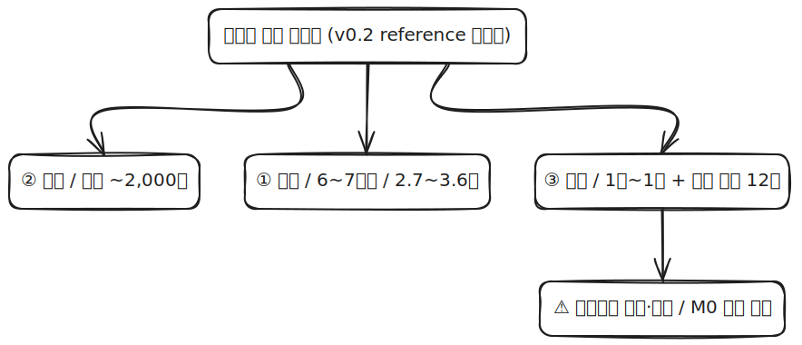

# 카집사 (CarGypsy)

> 차주 대신 대리기사가 차량을 픽업해서 제휴 공업사에 입고시키고, 정비 후 다시 가져다주는 **차량 정비 대행 플랫폼**.
>
> 작동 흐름 한 줄: **예약 → 픽업 → 입고 → 정비 → 반납 → 차계부 자동 갱신 + 다음 점검 알림**

---

## 🎨 라이브 목업 v0.1

[**▶ https://serendibeats.github.io/cargypsy/**](https://serendibeats.github.io/cargypsy/)

차주·기사·공업사·관리자 **4역할 11화면**을 한 페이지로 시각화한 인터랙티브 mockup. GitHub Pages 호스팅, 외부 CDN 의존성 0.

→ 소스: [`docs/index.html`](./docs/index.html) (단일 파일, ~106KB · Tailwind 인라인) · SRS US-C/D/S/A 매핑

---

## 이 repo는 무엇인가

외부에서 받은 **카집사 프로젝트 제안서**(`TalkFile_카집사PJT.docx.docx`, repo에는 미포함 — 비공개)를 정리한 자료. 두 가지 용도로 만들어졌다:

1. **제안자(비개발자)와의 미팅 정렬 자료** — 같이 보면서 "이렇게 큰 시스템이 필요하구나"를 체감
2. **개발·운영 비용 가늠** — 실제로 만들고 운영하면 얼마가 드는지의 정량 추정

비개발자도 처음부터 끝까지 이해할 수 있게 모든 숫자에 출처(reference)를 달아 검증했다.

---

## 한눈에 핵심 숫자

| 항목 | 규모 |
|---|---|
| 앱 종류 | **5종** (고객용 / 기사용 / 공업사용 / 차량용 / 관리자용) |
| 개발 기간 | **6-7개월**, **8-9명**(FTE = 풀타임 환산) |
| 개발 비용 (1회성) | **약 2.7억 - 3.6억** (정규직+외주 mix, 4대보험 포함, 보험·PIA 별도) |
| 운영 비용 (매월) | **약 2,000만/월** (인프라·외부 SaaS·운영 인력·보험 분할) |
| 결제 수수료 (별도) | 결제 거래액의 **3.4%** (월 5억 거래 시 약 1,700만/월) |
| 출시 전 법적·규제 | **약 1,000-10,000만** (변호사 선택·PIA 시행 여부에 따라 큼) |
| 매년 반복 의무 | **12종** (보험 갱신, 부가세, 위치정보 보고 등) |
| 손익분기점 (BEP) | **월 약 890건** (일 30건) |

> 모든 숫자의 reference는 [Cost doc §8 References](./CarGypsy-Cost.md#8-검증-부록)에서 확인 가능.

---

## 1. 어떤 시스템인가 (System Context)


카집사는 **4종 사용자**(차주·대리기사·공업사 직원·운영자)와 **9개 외부 서비스**(차량정보 조회·지도·결제·푸시 알림·사진 저장·본인인증 등)가 연결된 플랫폼이다. 각 사용자는 본인 앱에서 카집사와 상호작용하고, 카집사는 외부 서비스를 활용해 기능을 제공한다.

→ 더 자세한 구조는 [SAD: 시스템 아키텍처 문서](./CarGypsy-SAD.md)에서.

---

## 2. 어디서 비용이 드는가 (Cost Overview)



비용은 **3축**에서 발생한다:
- **① 개발** — 6-7개월 1회성, 약 2.7-3.6억 (인력 인건비가 대부분)
- **② 운영** — 매월 반복, 약 2,000만 + 결제 수수료(거래액의 3.4%)
- **③ 법적·규제** — 출시 전 1회성 + 매년 반복 12종 의무

→ 단가별 reference·시나리오·미해결 변수는 [Cost doc](./CarGypsy-Cost.md)에서.

---

## 3. 상세 문서 안내

| 문서 | 무엇을 다루는가 | 누가 읽으면 좋은가 |
|---|---|---|
| **[SRS](./CarGypsy-SRS.md)** (요구사항 명세서) | 5종 앱별 기능 요구사항 28개(유저 스토리), 페르소나, 사용자 여정, 외부 연동, 리스크 | 제안자 + 개발팀 |
| **[SAD](./CarGypsy-SAD.md)** (시스템 아키텍처 문서) | 5장 다이어그램(시스템 컨텍스트·컨테이너·시퀀스·ERD·배포) + 트레이서빌리티 | 제안자 + 개발팀 |
| **[Cost](./CarGypsy-Cost.md)** (비용·운영 가이드) | 4장 다이어그램(개요·개발·운영·법규) + 단가 reference + 출시 전 마일스톤 | 제안자 + 의사결정자 |

---

## 4. ⚠ 미팅에서 반드시 강조할 3가지

이 세 항목은 **놓치면 출시 자체가 불가능하거나 형사 처벌 리스크**가 있어, 제안자와 사전 합의가 필요하다.

### (1) 위치정보사업 등록 — 크리티컬 패스
- 방통위 등록 필수. **격월 정기 접수**(연 6회) + 심사 4-8주 → 실질 **6-12주**
- M0(법인 설립) 시점부터 즉시 동시 착수해야 출시 일정 안 밀림
- 신청 자체는 무료, 행정사 컨설팅 시장 통념 300-800만
- 상세: [Cost §5.2](./CarGypsy-Cost.md#5-법적규제-절차-비용-1회성--매년-반복)

### (2) 자동차취급업자 종합보험 — 크리티컬 패스
- 차주 미동승 차량 운행이 핵심이라 **표준 자동차보험으로 보장 안 됨**
- 영업용 미가입 시 **1년 이하 징역 또는 1,000만원 이하 벌금** + 영업용 과태료 230만
- 견적 청약 + 발효 4-6주 (3사 비교 권장)
- 상세: [Cost §5.2](./CarGypsy-Cost.md#5-법적규제-절차-비용-1회성--매년-반복)

### (3) 화물자동차운수사업법 회색지대
- 차주 미동승 픽업이 "탁송(화물운송)"인지 "운전대행"인지 회색지대
- 화물 운송 사업 허가 의무 여부에 따라 출시 가능성 자체가 흔들릴 수 있음
- **출시 전 변호사 자문 필수**

---

## 5. Repo 구조

```
CarGypsy/
├── README.md                    ← 지금 읽는 문서 (entry point)
├── CarGypsy-SRS.md              요구사항 명세
├── CarGypsy-SAD.md              시스템 아키텍처
├── CarGypsy-Cost.md             비용·운영 가이드
└── diagrams/
    ├── 01-05 (SAD 다이어그램 5장)
    └── 06-09 (Cost 다이어그램 4장)
```

각 다이어그램은 `.excalidraw.svg` 파일로, [excalidraw.com](https://excalidraw.com)에 드래그하면 그대로 편집 가능하다 (자세한 절차는 [SAD §7](./CarGypsy-SAD.md#7-편집-안내-부록)).

---

## 6. 미팅 활용 권장 순서

1. **README** (지금 읽는 페이지) — 5분, 전체 그림 잡기
2. **SRS §1 개요 + §2 페르소나** — 5분, 누가 무엇을 쓰는지
3. **SAD §2 시스템 컨텍스트** — 5분, 어떻게 생긴 시스템인지
4. **Cost §2 한눈에 + §5.2 크리티컬 패스** — 10분, 얼마 들고 무엇을 조심해야 하는지
5. **각 doc의 "미해결 이슈" / "검증 한계" 부분** — 마무리 토론

총 30분 내외로 전체 그림 합의 가능.

---

## 7. 문서 버전

| 문서 | 버전 | 마지막 갱신 |
|---|---|---|
| README | v1.0 | 2026-04-30 |
| SRS | v0.1 | 2026-04-30 |
| SAD | v0.1 | 2026-04-30 |
| Cost | v0.2 (인건비·운영비 reference 검증판) | 2026-04-30 |

피드백·질문은 미팅에서 합의 후 다음 버전에 반영.
